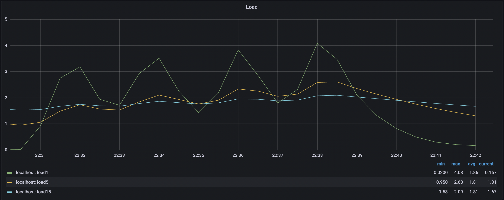
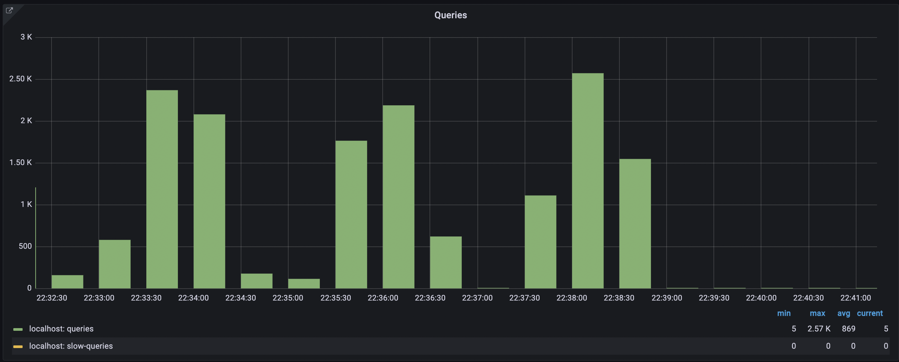
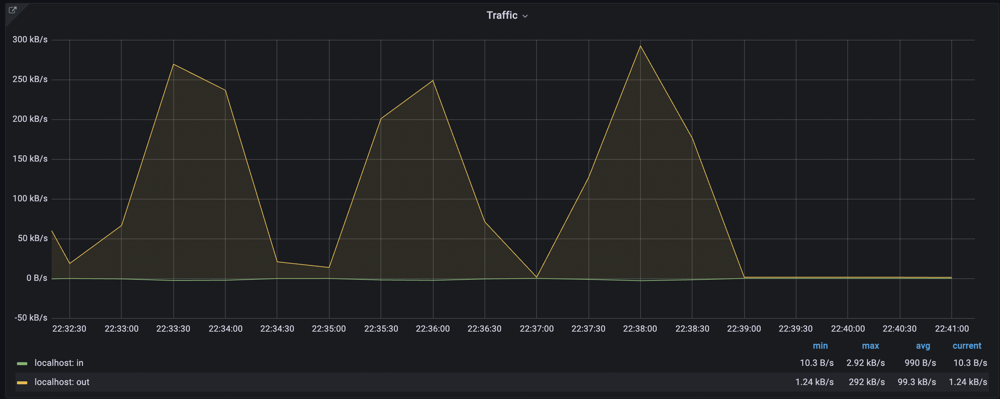
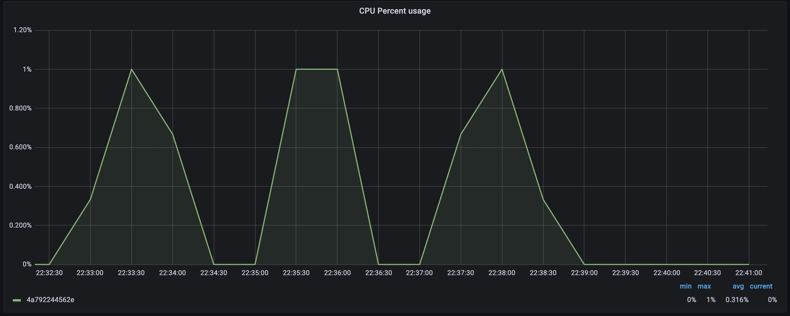
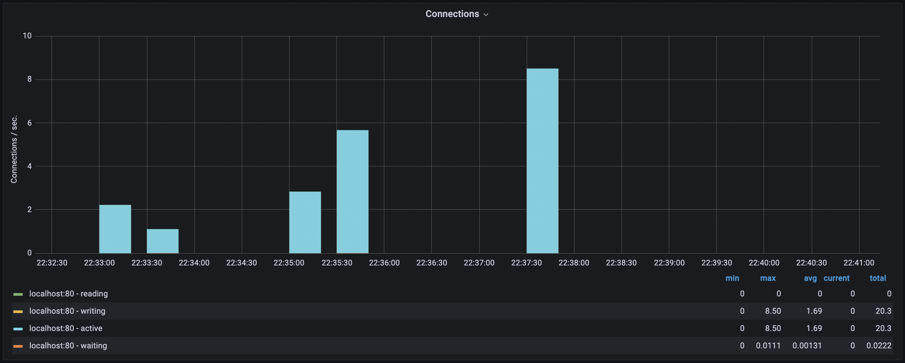
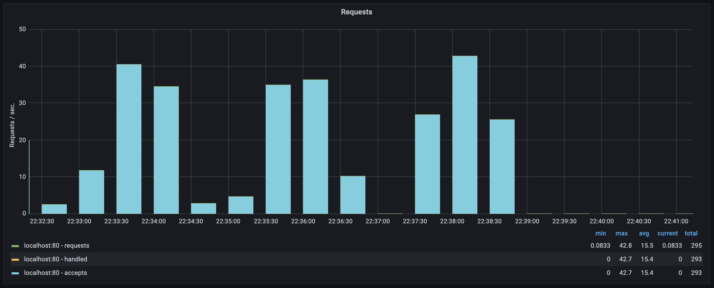

# TIG stack demonstration

TIG Stack Demo: Monitoring Ruby on Rails Application with Docker, MySQL, Elasticsearch, and Nginx

## Description

Welcome to the TIG Stack (Telegraf, InfluxDB, and Grafana) demonstration project! This repository contains a comprehensive setup to showcase the monitoring and performance tracking of a Ruby on Rails application using Docker containers. The stack includes MySQL as the database, Elasticsearch as the search engine, and Nginx as the reverse proxy for the Rails application.

## Project Overview

The main purpose of this project is to demonstrate how to monitor a Ruby on Rails application using the TIG Stack and Docker. The TIG Stack is composed of three primary components:

1. **Telegraf**: A powerful agent responsible for collecting, processing, and sending metrics and events to the InfluxDB database.

2. **InfluxDB**: A time-series database that stores and manages the collected metrics and data.

3. **Grafana**: A feature-rich visualization tool used to create dashboards and monitor various aspects of the application's performance.

Additionally, the project utilizes the following components:

- **MySQL**: A popular open-source relational database used to store application data.
- **Elasticsearch**: A distributed search engine for high-speed data retrieval and analysis.
- **Nginx**: A web server and reverse proxy that handles incoming web requests and forwards them to the appropriate backend services.

## Setup and Installation

To run the demonstration, follow these steps:

1. Ensure you have Docker installed on your system.
2. Clone this repository to your local machine.
3. Navigate to the project directory.

## Running the Demo

1. Start the Docker containers:

   ```bash
   docker-compose up

2. Wait for the services to initialize fully.

3. Generate load on the application using the provided siege_script.sh:

   ```bash
   sh siege_script.sh

## Screenshots of Grafana widgets during the load

**System**



**Docker**


**MySQL**





**Elasticsearch**



**Nginx**




